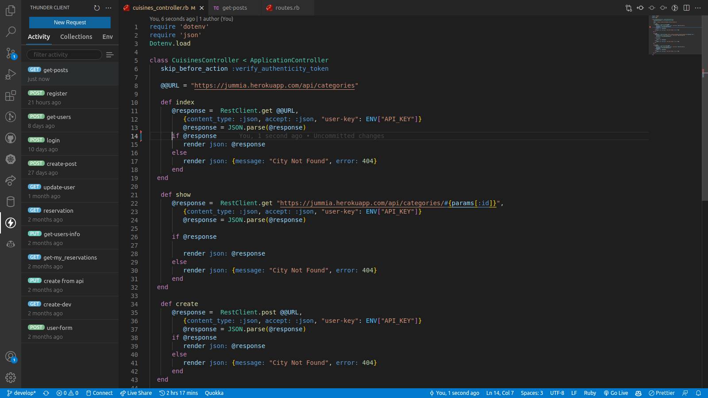
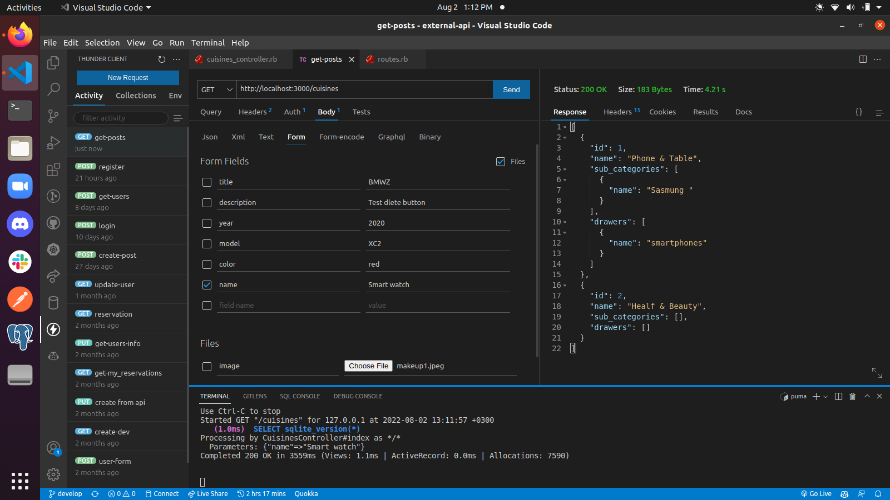

# RAILS EXTERNAL-API

> n order to put my Rails knowledge into practice, I implemented an external API (`One of my owner API's`) containing the data of the different categories. So I will create different methods on this API and get the data in JSON. 

   Create a .env file. This .env file must be created in the root folder, not inside any other folders, for example, our Gemfile is located in the root folder.
    Save the API key which we have generated from the Zomato API inside the .env file.
    .env file should look like this: API_KEY=abc22223333575757someapikey
    Hide the API key which is also known as the secret key, by typing.env inside the .gitignore file. Do Not Push anything to GitHub until you do this step.

Awesome, Now we are going to create a Cuisines Controller. Where we are going to send an HTTP GET request to the /cuisines end-point. Your controller should like this:

    require 'dotenv'
    require 'json'
    Dotenv.load

    class CuisinesController < ApplicationController 
        def index

        end
    end 

After we have created our Cuisines Controller and wrote a cuisines method inside, we are ready to make calls to the endpoints!

    now im using skipe to skipe the CSDF.
    Line 8: I'v created a global varable that contains the URL of the API that will be using in the all methods. 
    Line 11: In order to get categories , we need to send our first HTTP GET request to the categories endpoint using first RestClient, to get all the data which are saved in a variable called @response.
    Line 13: With the method JSON.perse, i'v converted the string to JSON so we will be having the data in the json format.

    Line 22: I've looking into all catories and render a particular category through the ID

Fire up your server and see the results:

    on your terminal, type rails s
    Using Postman: send a GET request to http://localhost:3000/cuisines
    Where the Query Params will be:
    Key: 1
    Value: categories (eg. 1)

If not using Postman, simply type : http://localhost:3000/cuisines in your web browser.

    In place of 1, you may type any number.

Here is an example of the response I am getting:

### Deployment

N/A

## Built With

- Rails
- Ruby 
- Rest-client
- Dotenv

## Getting Started

Here are the steps to follow in order to get this project on your local computer.

### Prerequisites

`rails v7.0.3 +`

`ruby v3.1.2 +`

### Setup

clone this repo by typing `git clone https://github.com/vic778/Class-manager`

### Install

install the dependencies by typing `bundle install`

### Usage

start the local server by running `rails s`

### Testing

run the tests by typing `bundle exec rspec`

### Documentation

## Author

👤 **Victor Barh**

- GitHub: [@Vvic778](https://github.com/vic778)
- Twitter: [@victoirBarh](https://twitter.com/)
- LinkedIn: [LinkedIn](https://linkedin.com/in/victoir-barh)

## 🤝 Contributing

Contributions, issues and feature requests are welcome!

Feel free to check the [issues page](issues/).

## Show your support

Give a ⭐️ if you like this project!

## Acknowledgments

 N/A

## 📝 License

This project is [MIT](lic.url) licensed.

   
